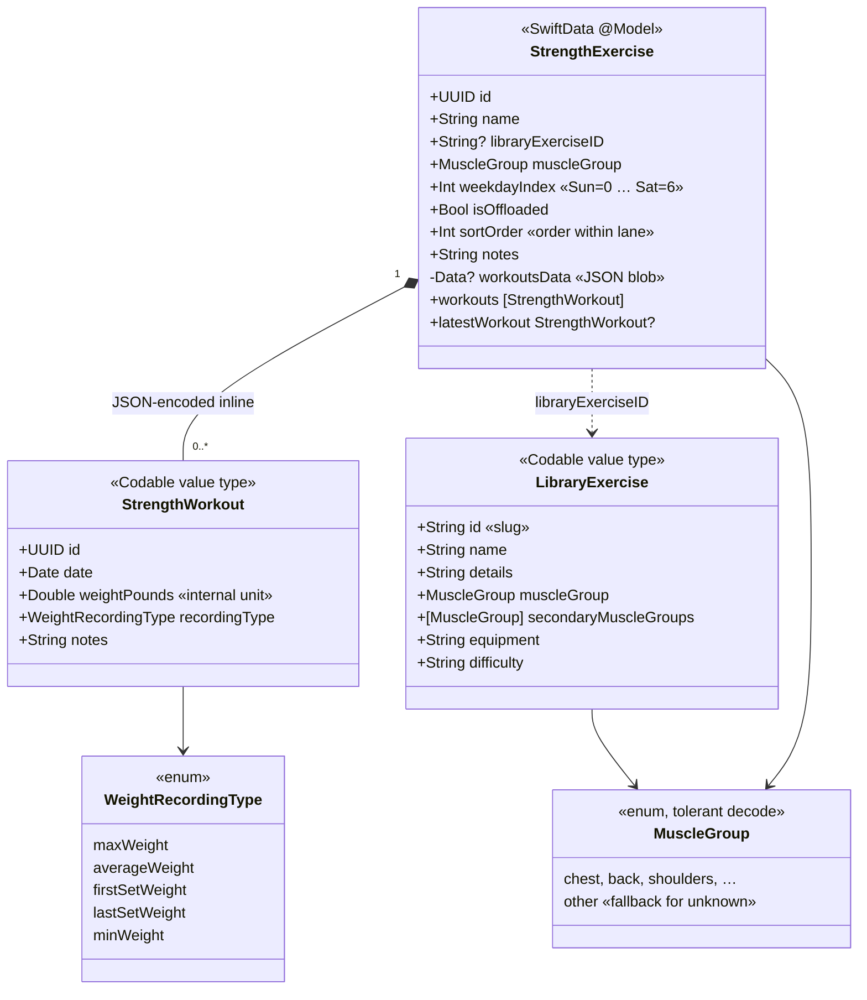
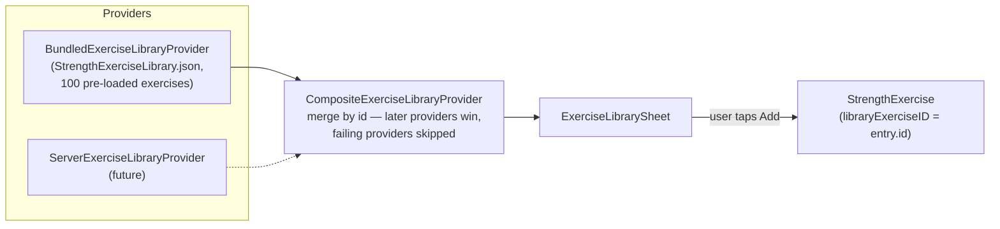
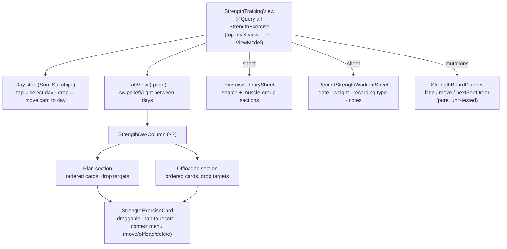
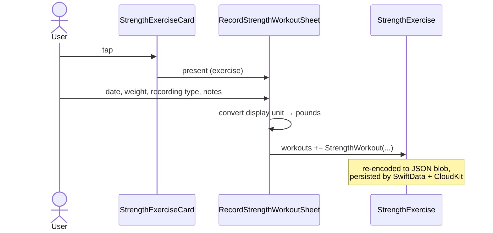

# Strength Training Feature

The Strength tab is a **kanban-style weekly board**. One column per day of the week
(Sunday–Saturday, matching the app's Sunday-start convention), swipeable left/right
like a project management app. Each column has two sections:

- **Plan** — the day's active, ordered exercise list.
- **Offloaded** — a lower holding section for exercises the user regularly does and
  wants to keep in mind, but has dragged out of the current week's plan. Cards can be
  dragged back into the active plan to reorganize workouts.

Unlike aerobic training, **strength exercises are undated**: they live permanently in
a day-of-week lane and accumulate dated weight records over time. A recorded
"workout" is just a date, a weight, and the *type* of weight recording — max, average,
first set, last set, or min — so trends like 1-rep max and average working weight can
later be graphed independently.

## Data Model

Design notes:

- **Workouts ride inside the exercise entity.** `StrengthWorkout` is a plain Codable
  struct stored as a JSON-encoded `Data?` blob on `StrengthExercise` — the same
  pattern as `Exercise.workout`. SwiftData's composite decoder fatalErrors on fetch
  of optional value structs, and CloudKit gets a single mirrored record with no
  relationship management.
- **Weight is stored in pounds internally**, mirroring the miles-internally
  convention for distance. Display conversion goes through
  `Double.formattedWeight(metric:)` / `to-/fromDisplayWeight(metric:)`
  (`Extensions/Double+Weight.swift`) driven by `@Environment(\.useMetricUnits)`.
- **All model properties have defaults** for CloudKit compatibility.
- `MuscleGroup` decodes unknown raw values to `.other` so newer server catalogs
  can't break older clients. Because of that custom `init(from:)`, SwiftData would
  treat the enum as a composite Codable attribute and **crash its encoder on save** —
  so `StrengthExercise` stores the raw string (`muscleGroupRaw`) and exposes a
  computed `muscleGroup`, the same pattern as `Workout.source`.

## Exercise Library

The library is **reference data, not user data** — it is never persisted in
SwiftData. Users browse it and add entries to their board, which creates a
`StrengthExercise` carrying a `libraryExerciseID` back-reference.

`ExerciseLibraryProvider` is an async-throwing protocol
(`Services/ExerciseLibrary/ExerciseLibraryProvider.swift`). The app's default is a
composite over just the bundled provider; enabling a server catalog is one line —
append the new provider to the composite's array. Merging is by `id`, with later
providers overriding earlier ones, so the server can both add new exercises and
patch bundled entries.

## View Hierarchy & Interaction

Drag-and-drop semantics (all funneled through `StrengthBoardPlanner.move`):

- **Drop on a card** → insert before that card, in that card's section.
- **Drop on section background** → append at the end of that section.
- **Drop on a day chip** → append to that day's active plan (cross-day moves work
  despite the paged TabView).
- Order within each lane is `sortOrder`, renumbered densely on every mutation.

Child views receive data as `let` parameters and report intent through closures;
only `StrengthTrainingView` owns the `@Query` and `ModelContext` mutations, per the
project's no-ViewModels convention.

## Recording Flow

## AI Coach Serialization

`Services/AICoach/StrengthCoachExport.swift` provides snapshot types and a
serializer, deliberately not yet plumbed into the coach prompt:

- `CoachStrengthWorkout` / `CoachStrengthExercise` — plain Codable snapshots of the
  SwiftData models (empty notes omitted, workouts sorted oldest-first).
- `StrengthCoachExporter.snapshots(from:)` / `jsonData(from:)` / `jsonString(from:)`
  — deterministic JSON (ISO 8601 dates, sorted keys), exercises in board order.

This mirrors the `CoachWorkout` / `CoachExercise` pattern in AICoachCore.

## Feature Plan / Extensibility Notes

Planned extension points, in the order they were designed in:

1. **Server-based exercise library.** Implement a `ServerExerciseLibraryProvider`
   (fetch + decode the same `LibraryExercise` JSON shape) and append it to
   `CompositeExerciseLibraryProvider.default`. Merge-by-id means server data can
   override bundled entries; `MuscleGroup`'s tolerant decoding means new muscle
   groups degrade gracefully to `.other` on old clients. Consider caching the last
   successful server payload so the merged library works offline.
2. **Graphing weight over time.** `WeightRecordingType` exists precisely so charts
   can plot 1-rep max (`maxWeight`) separately from actual working weight
   (`averageWeight`), and first/last-set trends for fatigue analysis. A future
   History integration can group `exercise.workouts` by `recordingType` and feed
   Swift Charts — no schema change needed.
3. **AI coach integration.** Wire `StrengthCoachExporter` output into
   `CoachingRequest` (likely moving the snapshot types into the `AICoachCore`
   package so the Evals CLI shares them), then extend `AICoachPromptBuilder` to
   serialize the strength section alongside aerobic data.
4. **Library growth.** The bundled catalog
   (`Resources/StrengthExerciseLibrary.json`, 100 exercises) is a plain JSON array —
   adding entries is a data change, not a code change. `LibraryExercise` keeps
   `equipment`/`difficulty` as free-form strings for forward compatibility.
5. **Richer workout records.** `StrengthWorkout` is a versionless Codable struct;
   new optional fields (sets, reps, RPE) decode as defaults on old data, matching
   how `Workout` gained fields over time.

## Testing

Unit tests live in `Hybrid AIthleticsTests/Hybrid_AIthleticsTests.swift`:

- Model defaults, explicit init, Codable round-trips, and SwiftData persistence
  (`StrengthExerciseTests`, `StrengthWorkoutTests`, enum tests).
- Weight conversion/formatting (`DoubleWeightTests`).
- Library decoding incl. tolerant muscle-group fallback (`LibraryExerciseTests`),
  bundled catalog integrity (≥100 unique entries), and composite merge precedence
  (`ExerciseLibraryProviderTests`).
- Board ordering math — reorder, cross-day, offload round-trips
  (`StrengthBoardPlannerTests`).
- Coach export field mapping, ordering, and JSON output
  (`StrengthCoachExporterTests`).
